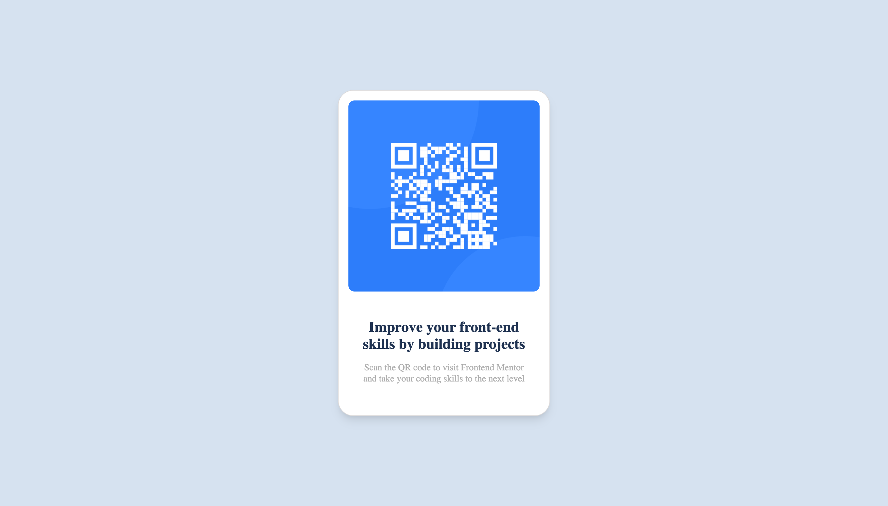

# Frontend Mentor - QR code component solution

This is a solution to the [QR code component challenge on Frontend Mentor](./design/frontendmentor_desktop.png). Frontend Mentor challenges help you improve your coding skills by building realistic projects. 

## Table of contents

  - [Screenshot](./design/frontendmentor_mobile.png)
  - [Built with]("html and Css")
  - [What I learned]("This is the best way of improving and testing your html css skills. In this project you will learn and understand flex much better")
- Author: Jesse Amabange

## Overview

### Screenshot

### Built with

- Semantic HTML5 markup
- CSS custom properties
- Flexbox
- CSS Grid
- Mobile-first workflow